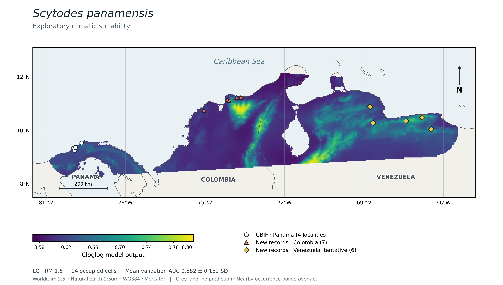
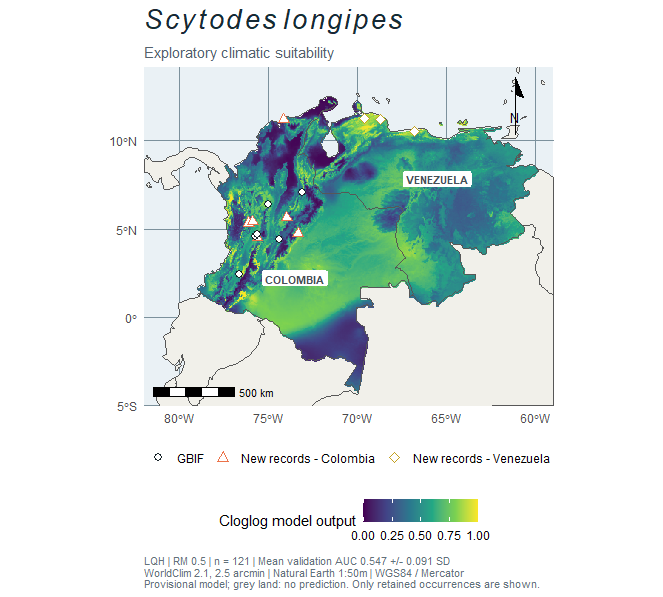

# Scytodes de Colombia y Venezuela: datos y modelos

Materiales complementarios del manuscrito **Spitting spiders (Araneae: Scytodidae) in Colombia and Venezuela: new records and natural history notes**.

El repositorio organiza los datos de GBIF, los nuevos registros aportados en el manuscrito, los análisis y la cartografía por especie. Los modelos climáticos son exploratorios y su validación muestra discriminación débil.

## Especies analizadas

| Especie | Materiales | Descarga GBIF | Modelo cartografiado | AUC de validación (media ± DE) |
|---|---|---|---|---|
| *Scytodes panamensis* | [Carpeta de la especie](Scytodes_panamensis/) | [10.15468/dl.p33n36](https://doi.org/10.15468/dl.p33n36) | LQ, RM 1.5 | 0.582 ± 0.152 |
| *Scytodes longipes* | [Carpeta de la especie](Scytodes_longipes/) | [10.15468/dl.r7a77w](https://doi.org/10.15468/dl.r7a77w) | LQH, RM 0.5; provisional | 0.547 ± 0.091 |

Las particiones de validación y regiones de calibración difieren entre especies; estos valores no constituyen una comparación controlada de desempeño.

## Organización

Cada carpeta contiene su propio README y las fuentes, código, evaluaciones y figuras. En *S. panamensis* se conservan los nombres `data/`, `scripts/`, `results/`, `figures/`, `supplementary/` y `docs/`, para mantener operativos los scripts existentes. En *S. longipes* se utilizan `datos/`, `scripts/`, `resultados/` y `figuras/`; el script genera sus mapas en `mapas/`.

## Mapas

### Scytodes panamensis

### Scytodes longipes

Para *S. longipes* solo se dispone aquí de la vista previa recibida. Los originales de alta resolución y el raster de predicción quedan pendientes.

## Reproducción y citas

Consulte las instrucciones de cada especie. Los DOI de GBIF identifican descargas de ocurrencias y deben citarse por separado del repositorio. Este repositorio todavía no tiene un DOI de archivo ni un lanzamiento estable. El nombre y la URL existentes se conservan para mantener los enlaces utilizados en el manuscrito.

## Pendientes del manuscrito

- Integrar el análisis de *S. longipes* en métodos, resultados y discusión.
- Incorporar las exportaciones originales del mapa y de la predicción de *S. longipes*.
- Verificar que los registros de la descarga formal de GBIF coincidan con los utilizados inicialmente mediante la API.
- Revisar taxonomía, vouchers y coordenadas; documentar el criterio de selección provisional de modelos.
- Crear un lanzamiento estable y archivarlo con DOI antes de la versión editorial definitiva.
