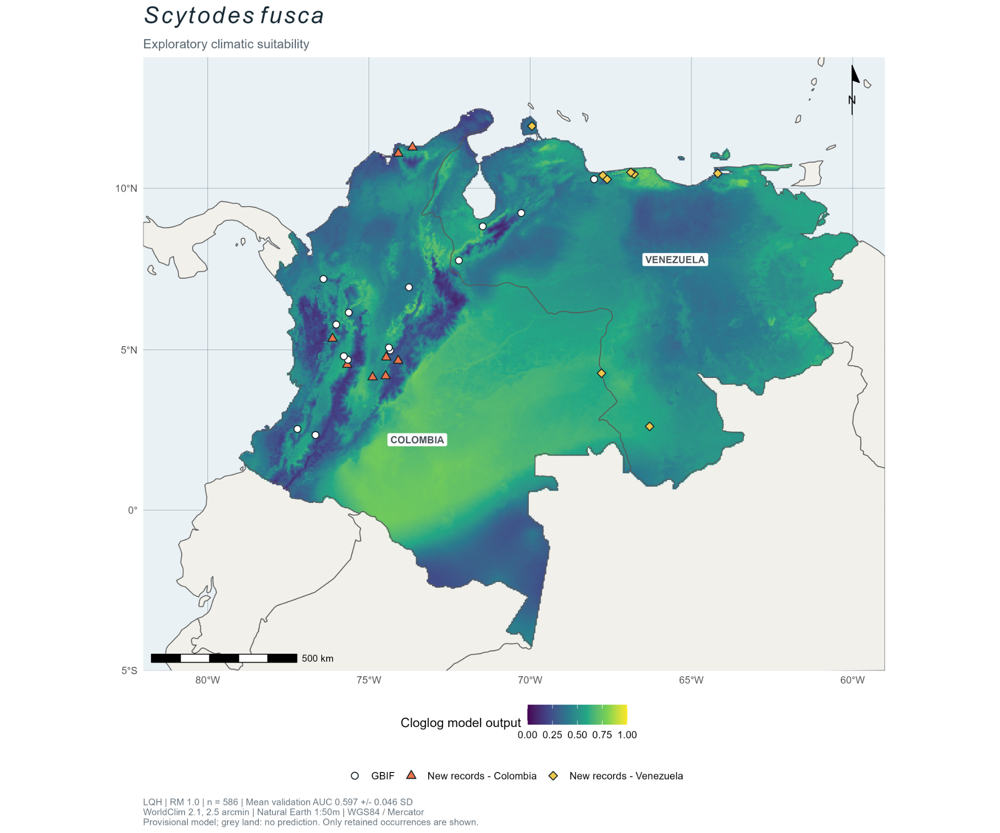

# Scytodes de Colombia y Venezuela: datos y modelos

Materiales complementarios del manuscrito **Spitting spiders (Araneae: Scytodidae) in Colombia and Venezuela: new records and natural history notes**.

El repositorio organiza los datos de GBIF, los nuevos registros aportados en el manuscrito, los análisis y la cartografía por especie. Los análisis exploratorios de idoneidad climática complementan los registros de distribución y las observaciones de historia natural del manuscrito.

## Especies analizadas

| Especie | Materiales | Descarga GBIF | Modelo cartografiado | AUC de validación (media ± DE) |
|---|---|---|---|---|
| *Scytodes panamensis* | [Carpeta de la especie](Scytodes_panamensis/) | [10.15468/dl.p33n36](https://doi.org/10.15468/dl.p33n36) | LQ, RM 1.5 | 0.582 ± 0.152 |
| *Scytodes longipes* | [Carpeta de la especie](Scytodes_longipes/) | [10.15468/dl.r7a77w](https://doi.org/10.15468/dl.r7a77w) | LQH, RM 0.5 | 0.547 ± 0.091 |
| *Scytodes fusca* | [Carpeta de la especie](Scytodes_fusca/) | [10.15468/dl.m67db8](https://doi.org/10.15468/dl.m67db8) | LQ, RM 4.5 y LQH, RM 1 | 0.535 ± 0.067 / 0.597 ± 0.046 |

Cada especie cuenta con una región de calibración y un esquema de validación propios, documentados en su carpeta.

## Organización

Cada carpeta contiene su propio README y las fuentes, código, evaluaciones y figuras. En *S. panamensis* se conservan los nombres `data/`, `scripts/`, `results/`, `figures/`, `supplementary/` y `docs/`, para mantener operativos los scripts existentes. En *S. longipes* se utilizan `datos/`, `scripts/`, `resultados/` y `figuras/`; el script genera sus mapas en `mapas/`.

## Mapas

### Scytodes panamensis

### Scytodes longipes

La figura de *S. longipes* presenta la proyección exploratoria para Colombia y Venezuela.

## Reproducción y citas

Los datos, scripts, evaluaciones y figuras se organizan por especie. Consulte las instrucciones de cada carpeta para reproducir los análisis y cite tanto el repositorio como las referencias de descarga GBIF indicadas en la tabla. URL pública: https://github.com/ldelgado-png/Scytodes-SDM.

## Scytodes fusca

