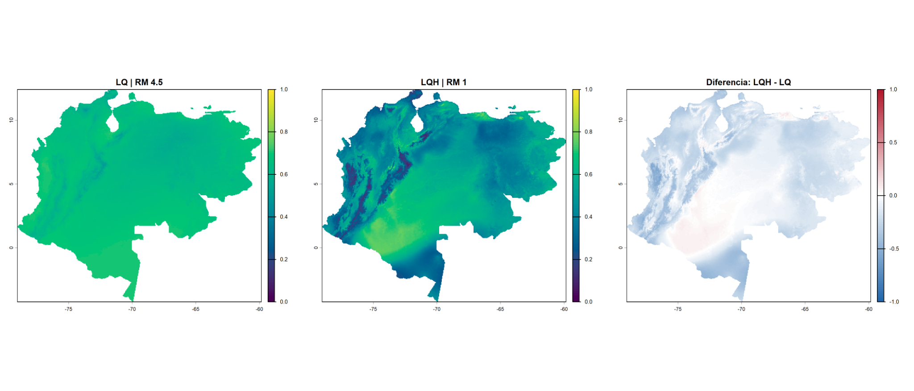

# Scytodes fusca: análisis exploratorio conservado

Datos GBIF globales + nuevos registros del manuscrito; proyección únicamente para Colombia y Venezuela. DOI aportado: [10.15468/dl.m67db8](https://doi.org/10.15468/dl.m67db8). Véase [procedencia y cotejo pendiente](datos/GBIF_DOI.md).

## Resultado y límites
1.479 registros georreferenciados de la API y 20 filas del manuscrito (17 coordenadas únicas). La corrida retuvo 586 presencias, de las cuales 569 se etiquetaron GBIF y 17 Manuscript. Se usaron 10.000 puntos de fondo; cuatro bloques de 147,146,147,146 presencias; WorldClim 2.1 a 2.5 minutos; BIO1, BIO4, BIO12 y BIO15; thinning 10 km; unión de buffers geodésicos de 111 km. La auditoría no garantiza validez de todas las coordenadas.

| Configuración | Criterio | AUC validación ± DE | Omisión 10p | ΔAICc |
|---|---|---|---|---|
| LQ, RM 4.5 | Menor omisión; provisional | 0.535 ± 0.067 | 0.114 | 143.141 |
| LQH, RM 1 | Menor AICc; alternativa | 0.597 ± 0.046 | 0.156 | 0 |

Ninguno de los 40 modelos cumple omisión media <=0.10. Un registro incompatible con el país declarado permanece en el ajuste: **GBIF 1291613600**, declarado Sudáfrica pero ubicado en Antártida. El autor conserva esta corrida sin nuevos ajustes; el efecto del registro no fue evaluado. Leer [limitaciones y archivos faltantes](docs/LIMITACIONES.md) antes de reutilizar.

## Mapas

97.465 celdas compartidas: Pearson 0.357; Spearman 0.327; diferencia absoluta media 0.164; RMSE entre predicciones 0.201. Son métricas por celda de concordancia, no exactitud frente a presencia real.

## Contenido y reproducción
- datos/: instantánea API, respuesta original comprimida, metadatos y registros nuevos.
- scripts/: pasos 01-04 y alternativa/comparación 05-06. Ejecutar desde Scytodes_fusca/, con RStudio, sin restaurar objetos SpatRaster desde .RData. 01 selecciona directorio; 02 reconstruye clima/fondo; 03 ajusta 40 modelos; 04 produce mapa inicial; 05-06 generan alternativa y comparación.
- resultados/block/: evaluación de 40 modelos, diagnóstico por bloque, presencias, grupos, concordancia y GeoTIFF de diferencias.
- mapas/: PNG alternativo, comparación y captura del mapa inicial.
- docs/: limitaciones y texto de integración al manuscrito.

02 incorpora el muestreo corregido que se ejecutó en consola (exhaustive=TRUE, values=TRUE y comprobación de 10.000 puntos). No elimina retrospectivamente el registro inconsistente. La corrida aquí archivada no se recalculó. No se incluyeron los dos GeoTIFF originales de predicción ni el fondo/modelos RDS, porque no fueron recibidos. El código permite reconstruirlos, pero no se comprobó aquí equivalencia numérica de una nueva ejecución.

## Citas
GBIF.org (2026). GBIF Occurrence Download. https://doi.org/10.15468/dl.m67db8 (metadatos y equivalencia pendientes de comprobación).

Repositorio general: https://github.com/ldelgado-png/Scytodes-SDM. Las licencias y atribuciones de registros GBIF corresponden a sus conjuntos fuente; el manuscrito aporta los nuevos registros. No atribuir al repositorio un DOI de archivo que no tiene.
